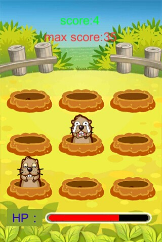

回
#ME 游戏框架 for slua
<b>ME_SLua是一个基于unity+slua技术的全LUA免费开源（带有资源下载功能）全平台游戏框架</b>

整理：小陆(QQ2604904) 参与者：顶梁猪(QQ756500);黄琰(QQ2355375795)

##友情提示

本游戏框架目前在参与者的不同实战项目中一边使用一边改动，代码改动可能是常态。

如果出现错误，请手工把slua目录下的luaobject文件夹删除。

##框架目标

<b>使用lua 编写2D,3D全平台运行游戏，一次编写，到处发布</b>

##本框架需要以下条件

1)unity3d 版本为 5.x以上

2)slua项目 地址 https://github.com/pangweiwei/slua

3)BestHTTP 详细 https://www.baidu.com/s?wd=besthttp

请自行下载slua和BestHTTP覆盖到本u3d工程项目目录

##核心思路

ME框架的思路就是 一个GameObject 对应挂个LuaBehaviour.cs脚本，这个LuaBehaviour.cs脚本DoFile一个lua脚本，lua脚本和LuaBehaviour.cs交互控制。

各各GameObject间通过Lua 消息进行通信。

框架附带打地鼠游戏截图:

##安装说明

Assets/Engine 为本框所有架核心代码，其它请和 https://github.com/pangweiwei/slua 保持一致.

Assets/Engine 为本框所有架核心代码

Assets/Atlas 将要打包的ui图片

Assets/Builds 将要打包的预置物

Assets/Data 升级包源目录（含全部资源和lua脚本），此文件夹将被压缩为zip放入Assets/StreamingAssets

Assets/StreamingAssets 为zip更新包输出目录，在执行ME Tools 菜单相关选项生成后，请把一份上传到wwwroot服务器目录内，供客户端下载更新。

Assets/Engine/Scene/Demo.unity  为测试场景

wwwroot目录为web服务器目录，请上传到您的web服务器 请修改version内json参数,status： 0 无更新，1有更新包;force 1强制更新,0不强制更新,downrul 更新包路径

首次运行工程(Assets/Engine/Scene/Demo.unity),程序从 StreamingAssets 中复制资源文件data.zip并解压到可读目标目录，然后从这可读目标目录加载主入口文件main.lua 执行,框架所有逻辑全部尽可能在lua端执行 。如：在lua中进行版本检测，下载zip，解压覆盖以后每次运行，会检测远程服务器版本，如果有更新，则下载，并自动解压覆盖资源目录。

##特性：

1)全lua代码编写游戏。

2)unity3d editor编辑器负责可视化资源的创建和打包。

3)使用内置ugui来做UI甚至游戏。

4)热更新更彻底：可通过热更新来更新成不同类型的游戏。带zip资源生成和下载。

5)通过纯lua“打地鼠”小游戏实战来提高框架的实用性.

##地鼠游戏资源打包以及编辑脚本测试使用帮助

请先自行下载slua项目覆盖到本u3d工程项目目录

1.执行编辑器菜单 ME tools/1.清理缓存,让一切重新开始.

2.执行编辑器菜单 ME tools/2.制作资源包 : 自动生成资源包并放入Asset->Data->asset目录 (for Unity5.0+)".

3.执行编辑器菜单 ME Tools/3.制作更新包 : 把Asset->Data目录压缩为一个zip包并放入StreamingAssets目录

通过以上步骤完成资源和升级包的制作了。

如果在编辑器进行代码修改或者资源修改，请重复以上步骤。

如果仅仅修改 Assets/Data/lua 下的逻辑脚本，您只需要执行编辑器菜单：

ME Tools/4.同步到缓存 : 直接复制Asset->Lua目录(内含所有lua脚本文件)到缓存。

